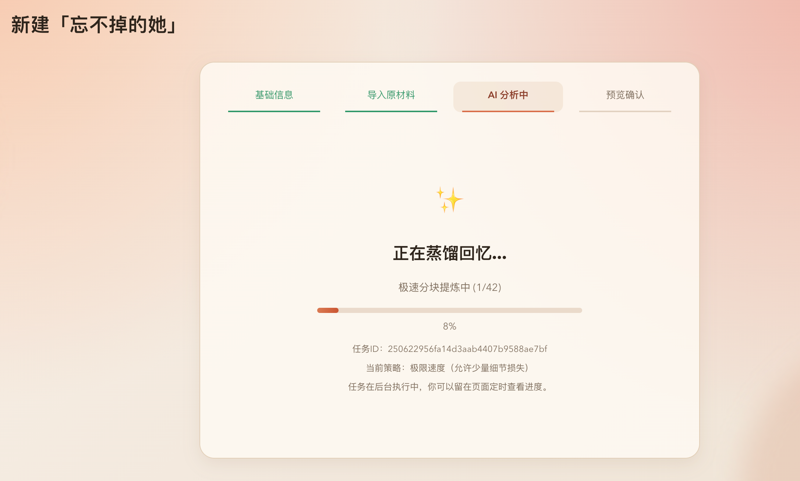
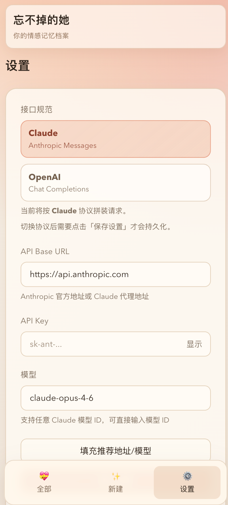

<div align="center">

# ex-web

> 把“前任 Skill”能力做成可视化 Web 应用。  
> 支持导入多来源材料，生成可聊天的记忆角色，并持续增量更新。

[](https://python.org)
[](https://fastapi.tiangolo.com)
[](https://react.dev)

</div>

---

## 致谢与来源

本项目基于 [perkfly/ex-skill](https://github.com/perkfly/ex-skill) 思路与能力进行二次开发，重点扩展为 **Web 端完整工作流**（创建向导、后台任务、预览确认、聊天与版本管理）。

如果你正在找原始 Skill 形态，请优先查看上游项目：

- [perkfly/ex-skill](https://github.com/perkfly/ex-skill)

---

## 这个项目做了什么

- 将原始 Skill 工作流产品化为 Web 应用（FastAPI + React）
- 支持多来源材料导入：微信 / iMessage / 短信 / 社交媒体 / 照片 / 直接粘贴
- 支持后台异步创建任务与进度轮询
- 支持生成前预览确认（避免直接落盘）
- 支持聊天纠正与增量更新
- 支持版本回滚

---

## Web效果

<p align="center">
  
</p>

<p align="center">
  
</p>

<p align="center">
  
</p>

<p align="center">
  
</p>

---

## 项目结构

```text
ex-web/
├── backend/                 # FastAPI 后端
│   ├── routers/             # settings / create / exes / chat / upload
│   ├── services/            # creation pipeline 与后台任务管理
│   ├── tools/               # 各类解析器与版本工具
│   ├── prompts/             # 提示词模板
│   └── static/              # 前端构建产物（默认 gitignore）
├── frontend/                # React + Vite 前端
├── exes/                    # 生成的数据目录（默认 gitignore）
├── run.py                   # 一键启动脚本
├── requirements.txt
└── settings.json            # 本地配置（默认 gitignore）
```

---

## 快速开始

### 1. 安装依赖

```bash
# 后端依赖
pip3 install -r requirements.txt

# 前端依赖
cd frontend
npm install
cd ..
```

### 2. 启动项目

```bash
# 生产模式（会自动构建前端）
python3 run.py

# 开发模式（uvicorn --reload + vite）
python3 run.py --dev
```

默认地址：`http://localhost:8765`

---

## 配置说明

首次启动后在 Web 设置页填写：

- `provider`：`claude` 或 `openai`
- `base_url`
- `api_key`
- `model`

安利一个中转站：https://www.aicodemirror.com/register?invitecode=HM74RP
---

## 许可

本仓库建议使用与上游兼容的开源协议（如 MIT），并在发布前补充 `LICENSE` 文件。
